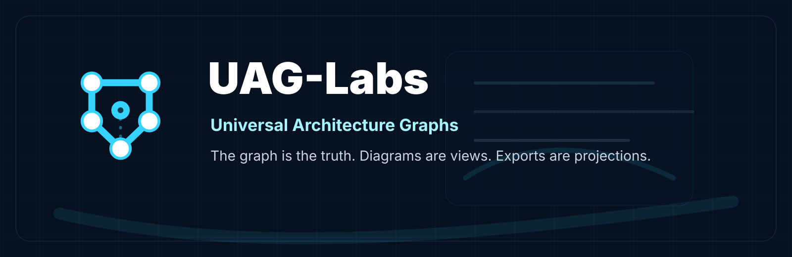

<p align="center">
  
</p>

# UAG-Labs

**Universal Architecture Graphs for software, systems, runtime, data, AI agents, and infrastructure.**

UAG-Labs is building a graph-native architecture modeling ecosystem where the architecture graph is the source of truth. Diagrams, documentation, API specs, deployment files, validation reports, and AI-readable context are generated projections from that graph.

```text
TAKG source graph
→ UAG compiler
→ UAGL compiled architecture IR
→ diagrams · docs · contracts · deployment stubs · AI context
```

## Core idea

Most architecture tools start with drawings. UAG starts with a typed semantic graph.

A normal diagram might show:

```text
Web App → API Server → Database
```

UAG is designed to preserve the deeper architecture meaning:

```text
FrontendApp calls BackendService over HTTPS.
BackendService exposes operations with contracts.
BackendService writes to a Database under a security boundary.
Database has ownership, retention, classification, and runtime constraints.
```

The central rule:

```text
The graph is the truth.
The diagram is a view.
The export is a projection.
```

## What UAG-Labs is building

| Repository | Purpose |
|---|---|
| [`UAG`](https://github.com/UAG-Labs/UAG) | Main project repository for specs, docs, examples, research, roadmap, and system-level context. |
| [`UAG-core`](https://github.com/UAG-Labs/UAG-core) | Shared Rust graph model, schemas, ontology, dialects, and validation primitives for TAKG and UAGL. |
| [`UAG-compiler`](https://github.com/UAG-Labs/UAG-compiler) | Rust compiler and CLI for transforming TAKG source graphs into UAGL compiled architecture IR and generated outputs. |
| [`UAG-studio`](https://github.com/UAG-Labs/UAG-studio) | React and Rust visual architecture graph editor for creating, validating, compiling, and exporting UAG projects. |

## TAKG and UAGL

### TAKG — Typed Architecture Knowledge Graph

TAKG is the editable source graph. It is what the visual editor works with. It can contain draft objects, layout data, partial architecture, editor metadata, and in-progress modeling state.

```text
.takg.yaml = editable architecture source graph
```

### UAGL — Universal Architecture Graph Language

UAGL is the compiled architecture IR. It is normalized, resolved, deterministic, validated, and suitable for export, analysis, and AI context generation.

```text
.uagl.yaml = compiled architecture intermediate representation
```

The intended workflow:

```text
Edit TAKG
→ compile to UAGL
→ validate UAGL
→ export from UAGL
```

## What the graph can model

UAG is designed to model architecture across a wide range of abstraction levels:

```text
business capabilities
bounded contexts
software systems
applications
services
modules
APIs
events
data contracts
databases
queues
streams
AI agents
MCP servers
model providers
runtime processes
threads
deployment environments
cloud infrastructure
operating system concepts
low-level hardware/software interfaces
validation rules
generated artifacts
```

The goal is not to flatten all of these into the same kind of box. The goal is to preserve their layer, plane, scope, fidelity, provenance, and relationships.

## Design principles

1. **Graph first** — architecture objects and relationships are the source of truth.
2. **Views are projections** — diagrams are generated views over the graph.
3. **Exports are lossy unless proven otherwise** — serious exports should report what they cannot preserve.
4. **TAKG and UAGL are separate** — editable source graph and compiled IR have different responsibilities.
5. **Rust for system-level implementation** — the core model, compiler, validators, and CLI are Rust-first.
6. **React for the visual editor** — Studio uses React, TypeScript, and a graph canvas UI.
7. **Dialects extend the system** — AI-agent, low-level systems, enterprise-domain, and data-system modeling should be extensions, not bloated core concepts.
8. **Validation must be semantic** — the system should catch architecture problems, not just syntax errors.
9. **High-level and low-level architecture need guardrails** — abstraction boundaries, time domains, safety constraints, and runtime/physical distinctions must be explicit.
10. **AI context must be safe and traceable** — generated AI context should preserve constraints, side effects, trust boundaries, and uncertainty.

## Current status

UAG-Labs is in the foundation-building phase. The first priority is to establish the specs, shared Rust model, compiler pipeline, and minimal Studio editor loop.

```text
UAG specs and examples
→ UAG-core Rust object model
→ UAG-compiler TAKG-to-UAGL compile path
→ UAG-studio minimal visual editing prototype
```

## Long-term mission

> Make architecture graph-native, typed, validatable, compilable, searchable, diffable, and understandable by both humans and AI systems.

UAG-Labs is building toward a world where architecture is not trapped inside static diagrams or scattered documentation, but lives as a compiled semantic graph.
